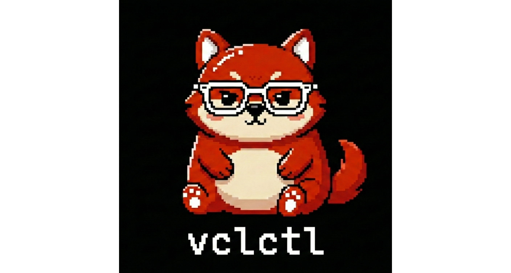
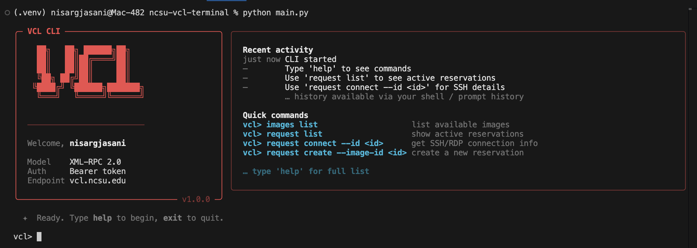
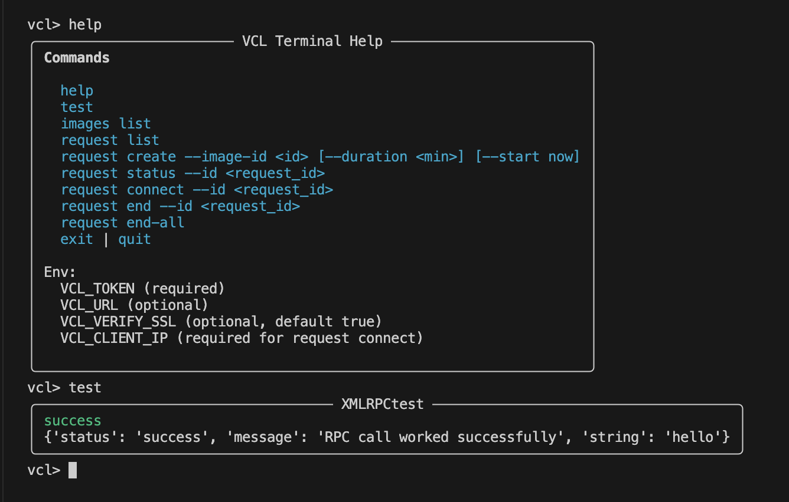
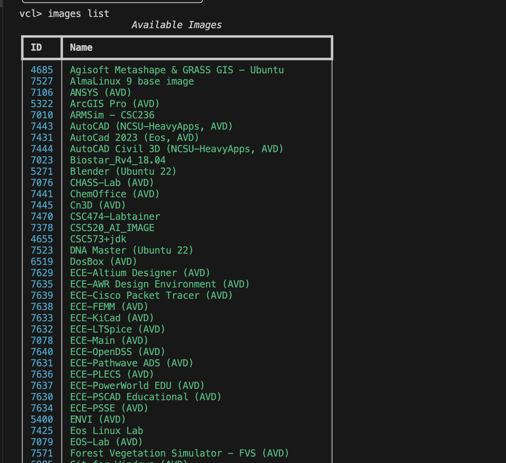
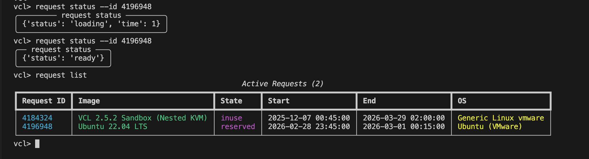
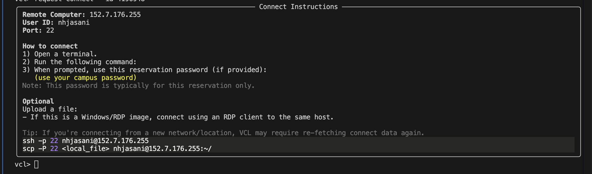
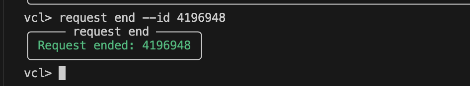

# 🖥️ vclctl — Apache VCL Terminal Client (NCSU Virtual Computing Lab)

vclctl is a modern terminal interface for managing Apache VCL reservations.  
It allows users to **browse available VM images**, **create and monitor reservations**, and **connect to virtual machines via SSH/RDP**, all without using the web interface.

<div align="center">
  

  
  
  
</div>

Built with Python and Rich TUI, vclctl provides a developer-friendly, interactive workflow with autocomplete, structured output, and clipboard integration.

------------------------------------------------------------------------



------------------------------------------------------------------------

> **Note:** You will need an active NCSU VCL account and a valid API
> token.\
> The CLI communicates directly with the official Apache VCL XML-RPC API
> --- no browser required.

------------------------------------------------------------------------

## Table of Contents

- [🖥️ vclctl — Apache VCL Terminal Client (NCSU Virtual Computing Lab)](#️-vclctl--apache-vcl-terminal-client-ncsu-virtual-computing-lab)
  - [Table of Contents](#table-of-contents)
  - [Setup](#setup)
    - [Installation](#installation)
    - [Getting Your API Token](#getting-your-api-token)
    - [Environment Variables](#environment-variables)
  - [Running the CLI](#running-the-cli)
  - [Screenshots](#screenshots)
    - [Startup](#startup)
    - [Help and Connectivity Test](#help-and-connectivity-test)
    - [Images List](#images-list)
    - [Active Requests](#active-requests)
    - [Connection Instructions](#connection-instructions)
    - [End Reservation](#end-reservation)
  - [Commands](#commands)
    - [General](#general)
    - [Images](#images)
    - [Requests](#requests)
  - [`request end-all`                                               End all active reservations](#request-end-all-----------------------------------------------end-all-active-reservations)
  - [✨ Features](#-features)
  - [Project Structure](#project-structure)

------------------------------------------------------------------------

## Setup

### Installation

``` bash
git clone https://github.com/NisargJasani0602/VCL.git
cd VCL

python3 -m venv .venv
source .venv/bin/activate       # macOS / Linux
.venv\Scripts\activate          # Windows

pip install -r requirements.txt
```

------------------------------------------------------------------------

### Getting Your API Token

1.  Log in to https://vcl.ncsu.edu\
2.  Navigate to **User Preferences → API Token**
3.  Generate a new token
4.  Copy the token

------------------------------------------------------------------------

### Environment Variables

Set the following before running the CLI.

  -----------------------------------------------------------------------
  Variable              Required              Description
  --------------------- --------------------- ---------------------------
  `VCL_TOKEN`           ✅ Yes                Your VCL API bearer token

  `VCL_URL`             No                    Override API endpoint

  `VCL_VERIFY_SSL`      No                    Set to `false` to disable
                                              SSL verification

  `VCL_TIMEOUT`         No                    Request timeout in seconds
                                              (default: `30`)
  -----------------------------------------------------------------------

``` bash
# required
export VCL_TOKEN="your_token_here"

# optional (from .env.example)
export VCL_URL="https://vcl.ncsu.edu/scheduling/index.php?mode=xmlrpccall"
export VCL_VERIFY_SSL=true
export VCL_TIMEOUT=30

```

> Find your public IP with:
>
> ``` bash
> curl ifconfig.me
> ```

------------------------------------------------------------------------

## Running the CLI

``` bash
python main.py
```

You'll see the startup banner and enter interactive mode:

    vclctl>

Type `help` to see all available commands.

------------------------------------------------------------------------

## Screenshots

### Startup


### Help and Connectivity Test



### Images List



### Active Requests



### Connection Instructions



### End Reservation



------------------------------------------------------------------------

## Commands

### General

  Command           Description
  ----------------- ---------------------------
  `help`            Show all commands
  `test`            Validate API connectivity
  `exit` / `quit`   Exit CLI

------------------------------------------------------------------------

### Images

  Command         Description
  --------------- --------------------------
  `images list`   List available VM images

------------------------------------------------------------------------

### Requests

  --------------------------------------------------------------------------------------------------------
  Command                                                         Description
  --------------------------------------------------------------- ----------------------------------------
  `request list`                                                  Show active reservations

  `request create --image-id <id> --duration <min> --start now`   Create a reservation

  `request status --id <id>`                                      Check reservation status

  `request connect --id <id> [--copy]`                            Show SSH/RDP connection info

  `request end --id <id>`                                         End reservation

  `request end-all`                                               End all active reservations
  --------------------------------------------------------------------------------------------------------

------------------------------------------------------------------------

## ✨ Features

-   Interactive `vclctl>` prompt
-   Arrow-key command history
-   Tab-based command autocomplete
-   Rich terminal UI (panels, tables, code blocks)
-   Structured SSH connection instructions
-   `--copy` option to copy SSH command to clipboard
-   Modular architecture (RPC layer + CLI layer)

------------------------------------------------------------------------

## Project Structure

    VCL/
    ├── main.py
    ├── requirements.txt
    │
    └── vcl/
        ├── __init__.py
        ├── banner.py
        ├── rpc.py
        ├── commands.py
        └── ui.py

------------------------------------------------------------------------

<details>
    <summary>
        Video Example
    </summary>
    <video src="https://github.com/user-attachments/assets/135c56c1-08be-43f1-912a-a3824fe40bb4">
</details>

<div align="center">
Built for NCSU students. Not affiliated with or endorsed
by NC State University.
</div>
